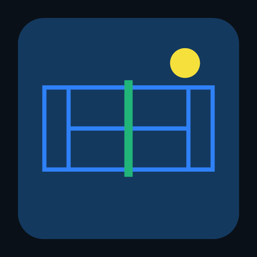

# Padel scoreboard

A free scoreboard app for padel. It installs onto an iPhone home screen, works
completely offline and keeps everything on your own phone — no account, no
adverts, no subscription.



**Available in Russian, English and Dutch.** It opens in Russian. Pick another
language in Settings — including "Automatic", which follows your phone.

## What it does

**Match scoring**
- Tap a team to award the point — one tap, one point.
- Points, games, sets, tiebreak and super tiebreak.
- You choose what happens at 40-40: advantage, golden point, or the **star
  point** from the FIP 2026 rules (two advantages, then one deciding rally).
- Tracks who serves, from which side, and when to change ends.
- Undo for every point, including back through a won game or set.

**Americano and Mexicano**
- 4 to 16 players across 1 to 4 courts.
- Americano: each round the app looks for the arrangement with the fewest
  repeated partners, so you play with as many people as possible.
- Mexicano: the standings set the pairs after every round — first with fourth
  against second and third.
- When the player count is not a multiple of four, sit-outs rotate fairly.
- Live per-player standings, because both formats are scored individually.

**History and statistics**
- Every finished match and tournament is kept.
- Group ranking: wins, losses, win rate, longest winning streak, podium
  finishes.
- Export and import a backup so nothing is lost when you change phone.

## Putting it on an iPhone

1. Host the folder (see below) and open the URL in **Safari**.
2. Tap the share button and choose **Add to Home Screen**.
3. Open it from the home screen from then on: it starts full screen, without a
   browser bar, and works with no connection.

Use Safari to install it — "Add to Home Screen" from Chrome on iOS does not
behave the same way.

## Hosting it

The app is plain HTML, CSS and JavaScript with no build step, so any static
host works.

**GitHub Pages** — enable Pages for this branch in the repository settings; the
app is then at `https://<user>.github.io/<repo>/padel/`.

**Locally**

```sh
cd padel
npx http-server -p 8123 -c-1 .
# open http://localhost:8123
```

Don't open `index.html` straight off disk: ES modules and the service worker
need `http://`.

## Tests

```sh
cd padel
node --test 'test/*.test.mjs'
```

The scoring rules, tournament scheduling, statistics, HTML escaping and the
translations each have their own tests. The translation tests check that every
language carries the same keys, that nothing is left blank, that plural keys
cover every form the language grammatically needs — Russian needs
one/few/many where English needs one/other — and that placeholders survive
translation.

## How it fits together

```
padel/
  index.html              the shell
  manifest.webmanifest    makes it an installable app
  sw.js                   caches everything for offline use
  css/app.css
  js/
    engine.js             scoring rules (points, games, sets, tiebreak, serve)
    tournament.js         Americano and Mexicano pairing and standings
    stats.js              ranking built from the history
    store.js              on-device storage
    i18n.js               translations, plurals and date formats
    views.js              every screen
    dom.js                safe HTML templates
    app.js                routing, state and actions
  test/                   node:test
```

A match is stored as nothing but the list of rally winners. Everything on
screen — the score, who serves, whether this is a star point — is recomputed
from that list. So the display can never drift out of step with the score, and
undo is simply dropping the last point.

No display text lives in the views: they call `t('some.key')`, and `i18n.js`
holds the three dictionaries. Adding a language means adding one dictionary;
the test suite then tells you exactly which keys are still missing.

Two separate constants decide language, and they are not the same thing:
`DEFAULT_LANGUAGE` in `i18n.js` is what the app opens in before anyone
chooses (Russian), while `FALLBACK` is the dictionary consulted for a key a
language happens to be missing (English). Change the first to open in a
different language.

## Privacy

Nothing is sent to a server. Everything sits in your browser's local storage.
Clear your browsing data and the history goes with it, so make a backup now and
then from Settings.
